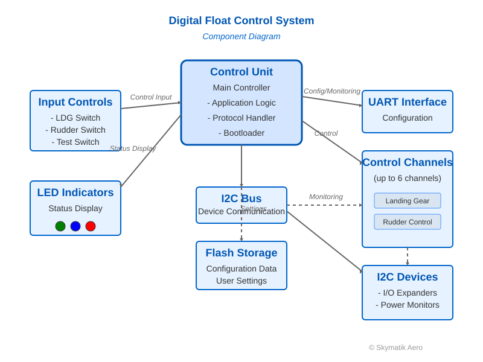

= Digital Float Control System
:doctype: book
:toc: left
:toclevels: 3
:sectnums:
:sectnumlevels: 4
:icons: font
:pdf-page-size: A4
:pdf-style: default
:experimental:
:source-highlighter: rouge
:chapter-label: Chapter
:version-label: Version
:revdate: April 15, 2025
:revnumber: 1.0
:revremark: First Official Release
:company: Skymatik Aero
:product: Digital Float Control
:title-logo-image: 

// Front page title
[discrete]
= {product} System
[discrete]
== User Manual
[discrete]
=== For Experimental and Special Category Aircraft

[discrete]
=== Version {revnumber}

[.text-center]
{company} +
{revdate}

// Legal notice
[.small]
--
CONFIDENTIAL: This document contains proprietary information and is provided under a license agreement. 
It may not be copied or shared without written permission from {company}.

Copyright © 2025 {company}. All Rights Reserved.
--

// Important disclaimer about experimental aircraft use
[IMPORTANT]
====
The {product} System is designed for installation in Experimental, Amateur-Built, and Special Category aircraft only. This product is not FAA/EASA certified for installation in type-certificated aircraft.

Installation of this equipment in an aircraft is a major alteration and may require appropriate documentation and testing in accordance with applicable aviation regulations. Builders and owners are responsible for ensuring compliance with all applicable regulations regarding installation and operation of this equipment.
====

// Table of contents will be automatically generated here
<<<

== Introduction

Thank you for choosing the {product} System. This manual provides detailed information on the installation, operation, and maintenance of your system. The {product} System is designed to provide reliable control of experimental aircraft landing gear and rudder motors, with visual status indication via LEDs.

[NOTE]
====
This system is specifically designed for experimental and special category aircraft. It is not approved for installation in standard type-certificated aircraft under FAA Part 23, Part 25, Part 27, Part 29 or equivalent EASA regulations without appropriate field approval or STC (Supplemental Type Certificate).
====

.Document Information
[cols="1,2", options="header"]
|===
|Item |Description
|Document Version |{revnumber}
|Release Date |{revdate}
|Document Status |{revremark}
|Product |{product} System for Experimental Aircraft
|Manufacturer |{company}
|Aircraft Applicability |Experimental, Amateur-Built, and Special Category Only
|===

== System Overview

The {product} System consists of the following major components:

* *Control Unit*: Central processing module with firmware that manages all system functions
* *LED Indicators*: Multi-color status lights that display system state
* *Control Channels*: Up to 6 independent channels for motor control
* *Input Switches*: Landing gear and rudder position switches
* *Test Switch*: For diagnostics and configuration functions
* *Communication Port*: UART interface for configuration and diagnostics

Each control channel can be configured for either landing gear or rudder operation, with different behavior profiles for each type. This flexibility makes the system ideal for various experimental aircraft configurations.

.System Block Diagram
[#system-diagram]
[.text-center]

_Figure 1: {product} System Component Diagram_

== Installation and Setup

=== Physical Installation

[CAUTION]
====
Installation in experimental aircraft should follow best practices for aviation electrical systems. While this product is designed for reliability, the builder/operator is responsible for ensuring proper installation, testing, and operation.
====

==== Mounting the Control Unit
* Mount the unit in a dry, accessible location using the four mounting holes
* Ensure adequate ventilation and protection from vibration
* Operating temperature range: -20°C to +70°C

[WARNING]
====
Ensure proper cooling and ventilation for the control unit. Inadequate cooling may result in overheating and reduced reliability.
====

==== Connecting Motor Channels
* Connect control channels to the appropriate motors
* Observe proper polarity as indicated on the terminal labels
* Maximum load: 2A per channel at 28V DC

[IMPORTANT]
====
Exceeding the maximum load rating may result in damage to the control circuits. Always use appropriate fusing and protection circuits.
====

==== Switch Inputs
* Connect landing gear position switch to the LDG terminal
* Connect rudder position switch to the RUD terminal
* Switches should be dry contact type (no voltage)

==== Power Connection
* Connect power supply (24V DC nominal)
* Observe proper polarity
* System requires 2A minimum supply capacity

=== Initial Configuration

After installation, the system requires initial configuration:

. Apply power to the unit
. Connect to the communication port using a terminal program
** Baud rate: 115200
** Data bits: 8
** Parity: None
** Stop bits: 1
** Flow control: None
. Use the command protocol (see <<command-protocol,Command Protocol>>) to configure channel settings

[TIP]
====
Before beginning configuration, verify all electrical connections and ensure that the system is receiving proper power.
====

== Basic Operation

=== Normal Operation Mode

During normal operation, the system:

* Monitors the landing gear and rudder position switches
* Controls the appropriate motors based on switch positions
* Displays status via LED indicators
* Monitors voltage and current for fault detection

=== Operational States

Each channel can be in one of the following states:

UP:: Channel is in the up position
DOWN:: Channel is in the down position
MOVING:: Channel is transitioning between positions
ERROR:: Channel has detected a fault condition

=== Switching Procedure

.To operate the landing gear:
. Move the landing gear switch to the desired position
. System will automatically control motors to achieve the position
. LED indicators will show the current state
. Motors will stop automatically when position is reached

.To operate the rudder:
. Move the rudder switch to the desired position
. System will automatically control the rudder motor
. LED indicators will show the current state
. Motor will stop automatically when position is reached

== LED Indicators

The system uses multi-color LED indicators to show the status of each channel:

=== Landing Gear Indicators

* *Green* (default): Landing gear is down and locked
* *Blue* (default): Landing gear is up and locked
* *Blinking*: Landing gear is in motion
* *Blinking Red*: Error condition detected

=== Rudder Indicators

* *Yellow* (default): Rudder is in central position
* *Purple* (default): Rudder is in deflected position
* *Blinking*: Rudder is in motion
* *Blinking Red*: Error condition detected

=== Custom Colors

All indicator colors can be customized using the command protocol (see <<command-protocol,Command Protocol>>).

.Default LED Color States
[#color-states]
[cols="1,1,2,1", options="header"]
|===
|Channel Type |State |Default Color |Indication
|Landing Gear |DOWN |Green |Gear down and locked
|Landing Gear |UP |Blue |Gear up and locked
|Landing Gear |MOVING |Blinking Green/Blue |Gear in transition
|Landing Gear |ERROR |Blinking Red |Fault detected
|Rudder |DOWN |Yellow |Central position
|Rudder |UP |Purple |Deflected position
|Rudder |MOVING |Blinking Yellow/Purple |Position in transition
|Rudder |ERROR |Blinking Red |Fault detected
|===

== Test Switch Functions

The system includes a test switch that provides access to diagnostic and configuration functions:

=== Momentary Press

A brief press of the test switch during normal operation will initiate a self-test sequence:

* LED indicators will cycle through red, green, and blue
* System will test all relays
* Results will be displayed via LED indicators

=== Extended Press

Pressing and holding the test switch for more than 5 seconds enters LED brightness adjustment mode:

. LEDs will display white at different brightness levels
. Release the test switch when desired brightness is achieved
. Setting is automatically saved to memory

[NOTE]
====
The test switch is also used during firmware updates to enter the bootloader mode. See <<firmware-update,Firmware Update>> for details.
====

== Configuration Options

The system supports the following configuration options:

=== User Settings

* LED brightness
* LED colors for different states
* Wait time before operation

=== Channel Settings

For each channel:

* Channel type (landing gear or rudder)
* I2C addresses for monitoring and control devices
* Voltage limits (minimum and maximum)
* Calibration values for current sensing

== Command Protocol
[#command-protocol]

The system supports a command-based protocol for configuration and diagnostics via the UART interface.

=== Supported Commands

* *v*: Get application version
* *r*: Reset device
* *s*: Scan I2C devices (parameter: I2C address)
* *u*: Get user settings
* *U*: Update user settings
* *c*: Get channel settings (parameter: channel number)
* *C*: Update channel settings
* *m*: Get monitoring data (parameter: channel number)
* *t*: Test specific channel

=== Command Format

Commands are sent as ASCII strings with the following format:
[source]
----
<command_char><optional_parameters>
----

Example:
[source]
----
v           # Get version
c2          # Get settings for channel 2
m0          # Get monitoring data for channel 0
----

Responses are formatted as JSON objects with command-specific data fields.

.Example Command Response
[source,json]
----
{
  "command": "v",
  "status": "success",
  "data": {
    "version": "1.0.5",
    "build_date": "2025-03-15"
  }
}
----

== Troubleshooting

=== Error Indicators

Error conditions are indicated by red blinking LEDs. The specific pattern may indicate the error type:

* *Rapid blinking*: Communication error with I2C device
* *Slow blinking*: Power parameter out of range
* *Double blink*: Motor control failure

=== Common Issues

[#troubleshooting-table]
[cols="1,1,2", options="header"]
|===
|Problem |Possible Cause |Solution
|System doesn't power up |Incorrect power connection |Check power polarity and voltage
|Channel doesn't respond |Channel disabled in settings |Enable channel in configuration
|Error indication on channel |Excessive current draw |Check for mechanical obstruction
|Error indication on channel |Device communication error |Check I2C connections
|Erratic operation |Electrical noise |Improve wiring shielding
|===

=== Firmware Update
[#firmware-update]

If firmware update is required:

. Connect to UART interface
. Put system in bootloader mode by power cycling while holding test switch
. Use the firmware update tool to send new firmware
. Restart the system after update completes

[CAUTION]
====
Do not interrupt the firmware update process once it has started. Doing so may render the device inoperable and require factory service.
====

== Maintenance

=== Routine Inspection

Perform the following checks regularly:

* Inspect all electrical connections for security
* Check for signs of overheating or damage
* Test system operation using the test switch
* Verify correct LED indication for all states

[IMPORTANT]
====
For experimental aircraft, maintenance of the control system should be included in your aircraft's maintenance schedule and logbook. Regular testing is essential for ensuring continued safe operation.
====

=== Calibration

The system should be recalibrated annually or after any significant system modification:

. Access the calibration function via the command protocol
. Follow the prompted sequence to measure reference values
. Save the new calibration data

.Recommended Maintenance Schedule
[#maintenance-schedule]
[cols="1,1,2", options="header"]
|===
|Interval |Maintenance Item |Description
|Weekly |Visual inspection |Check for loose connections, damage, or overheating
|Monthly |Functional test |Use test switch to verify proper operation
|Annually |Calibration |Perform full system calibration
|As needed |Firmware update |Update to latest firmware version
|===

== Technical Specifications

=== Electrical

* Input voltage: 24V DC nominal (20-30V DC range)
* Power consumption: 2A maximum (all channels active)
* Channel output: 2A maximum per channel
* Communication: UART, 115200 baud

=== Mechanical

* Dimensions: 120mm x 80mm x 30mm
* Weight: 200g
* Operating temperature: -20°C to +70°C
* Storage temperature: -40°C to +85°C
* Humidity: 0-95% non-condensing

=== Compliance Information

* Designed for experimental and special category aircraft
* Not certified for installation in type-certificated aircraft
* Builder/operator responsible for compliance with applicable regulations

[NOTE]
====
While this product is designed to high quality standards, it does not have formal certification for installation in type-certificated aircraft. Installation in certified aircraft would require appropriate field approval or STC process.
====

== Warranty and Support

The {product} System is warranted against defects in materials and workmanship for a period of two years from the date of purchase.

For technical support:

* Email: support@skymatikaero.com
* Phone: +1-555-123-4567
* Web: www.skymatikaero.com/support

Please have your serial number ready when contacting support.

[appendix]
== Command Reference

This appendix provides a complete reference of all available commands for the {product} System.

.Command Summary
[cols="1,2,3", options="header"]
|===
|Command |Parameters |Description
|v |None |Get application version information
|r |None |Reset the device
|s |I2C address |Scan for I2C device at specified address
|u |None |Get current user settings
|U |JSON settings object |Update user settings
|c |Channel number (0-5) |Get settings for specified channel
|C |JSON channel settings object |Update channel settings
|m |Channel number (0-5) |Get monitoring data for specified channel
|t |Channel number (0-5) |Test specified channel
|===

[appendix]
== Glossary

[glossary]
LED:: Light Emitting Diode. Used for visual status indication.
UART:: Universal Asynchronous Receiver/Transmitter. Serial communication interface.
I2C:: Inter-Integrated Circuit. A serial communication bus used for device communication.
Bootloader:: Software that loads when a device powers on, allowing firmware updates.
Experimental Aircraft:: Aircraft built by amateurs, from kits, or for research and development purposes, not certified under standard type certificates.
Special Category Aircraft:: Aircraft with special airworthiness certificates such as limited, exhibition, or amateur-built.

[colophon]
== Colophon

This document was created using AsciiDoc and formatted for print and digital distribution.

{product} System User Manual for Experimental Aircraft +
Version {revnumber} ({revdate})

Copyright © 2025 {company}. All Rights Reserved.

[.text-center]
_Printed in the Republic of Poland_

// Page footer with page number and copyright
ifdef::backend-pdf[]
[%backmatter]
++++

++++
endif::[] 